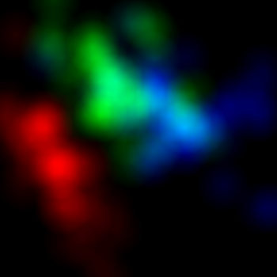
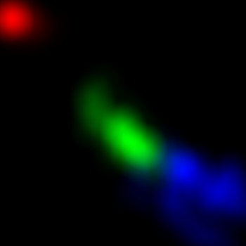
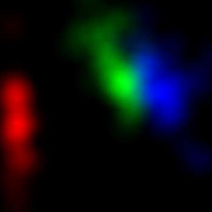
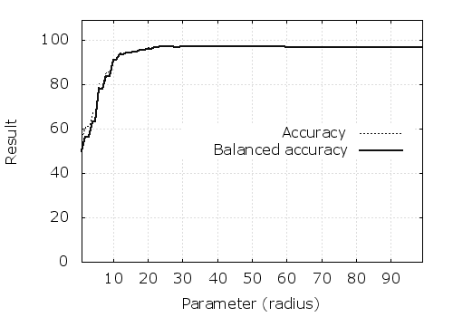
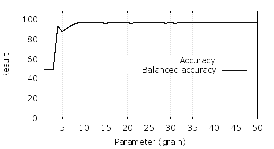
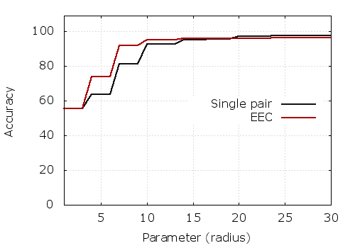
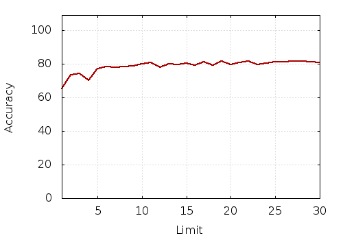

# Exposer Ensemble Classifier

## Requirements

- pypng

## Conception

## Classification

Na oko klasy najmniej mieszaja sie w parze 3:4. Wiec sprobujmy uzyc tego cudu do klasyfikacji.

Najpierw zbadajmy radius.

#### Experiment 1

	dataset: iris
	grain: 50
	one exponer ([2,3])

	testing radiuses in 1:99
	

#### Experiment 2

	dataset: iris
	radius: 30
	one exponer ([2,3])
	
	testing grains in 1:50

## Ensemble of _exponers_

Zwyczajna akumulacja wsparć z wielu eksponerów.

#### Experiment 3
	
	dataset: iris
	grain: 20
	exponers: all possible combinations vs one exponer ([2,3])
	
	testing radiuses in 1:30

## Naive approach to deal with the curse of dimensionality

#### Experiment 4

	dataset: heart
	grain: 10
	radius: 100
	
	testing random exponers limits from 1:30
	

## Self-confidence measure

### One per exponer

### One per class in exponer

## Threedimensional _exponers_

## Joint model

Akumulujmy eksponery 2D i 3D.

## Heuristic approach to deal with the curse of dimensionality